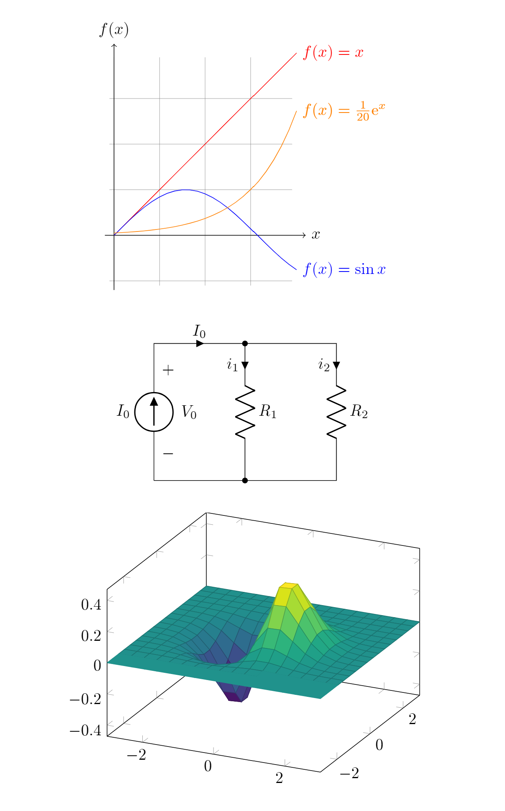
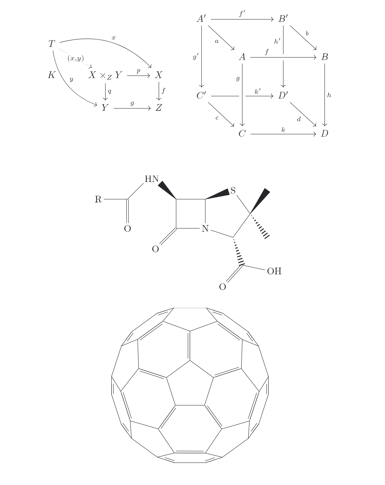

# Obsidian TikZJax
A plugin for Obsidian that lets you render LaTeX and TikZ diagrams in your notes. WIP!

Currently has these packages available in \usepackage{}:
- chemfig
- tikz-cd
- circuitikz
- pgfplots
- array
- amsmath
  - amstext
- amsfonts
- amssymb
- tikz-3dplot


## Installation
You can currently install the plugin via BRAT.

Alternatively, you can manually install it by copying the `main.js`, `manifest.json`, and `styles.css` files into a folder `.obsidian/plugins/obsidian-tikzjax`.


## Usage
### Input:

````latex
```tikz
\begin{document}
  \begin{tikzpicture}[domain=0:4]
    \draw[very thin,color=gray] (-0.1,-1.1) grid (3.9,3.9);
    \draw[->] (-0.2,0) -- (4.2,0) node[right] {$x$};
    \draw[->] (0,-1.2) -- (0,4.2) node[above] {$f(x)$};
    \draw[color=red]    plot (\x,\x)             node[right] {$f(x) =x$};
    \draw[color=blue]   plot (\x,{sin(\x r)})    node[right] {$f(x) = \sin x$};
    \draw[color=orange] plot (\x,{0.05*exp(\x)}) node[right] {$f(x) = \frac{1}{20} \mathrm e^x$};
  \end{tikzpicture}
\end{document}
```
````


````latex
```tikz
\usepackage{circuitikz}
\begin{document}

\begin{circuitikz}[american, voltage shift=0.5]
\draw (0,0)
to[isource, l=$I_0$, v=$V_0$] (0,3)
to[short, -*, i=$I_0$] (2,3)
to[R=$R_1$, i>_=$i_1$] (2,0) -- (0,0);
\draw (2,3) -- (4,3)
to[R=$R_2$, i>_=$i_2$]
(4,0) to[short, -*] (2,0);
\end{circuitikz}

\end{document}
```
````


````latex
```tikz
\usepackage{pgfplots}
\pgfplotsset{compat=1.16}

\begin{document}

\begin{tikzpicture}
\begin{axis}[colormap/viridis]
\addplot3[
	surf,
	samples=18,
	domain=-3:3
]
{exp(-x^2-y^2)*x};
\end{axis}
\end{tikzpicture}

\end{document}
```
````

### Output:



### Input:

````latex
```tikz
\usepackage{tikz-cd}

\begin{document}
\begin{tikzcd}

    T
    \arrow[drr, bend left, "x"]
    \arrow[ddr, bend right, "y"]
    \arrow[dr, dotted, "{(x,y)}" description] & & \\
    K & X \times_Z Y \arrow[r, "p"] \arrow[d, "q"]
    & X \arrow[d, "f"] \\
    & Y \arrow[r, "g"]
    & Z

\end{tikzcd}

\quad \quad

\begin{tikzcd}[row sep=2.5em]

A' \arrow[rr,"f'"] \arrow[dr,swap,"a"] \arrow[dd,swap,"g'"] &&
  B' \arrow[dd,swap,"h'" near start] \arrow[dr,"b"] \\
& A \arrow[rr,crossing over,"f" near start] &&
  B \arrow[dd,"h"] \\
C' \arrow[rr,"k'" near end] \arrow[dr,swap,"c"] && D' \arrow[dr,swap,"d"] \\
& C \arrow[rr,"k"] \arrow[uu,<-,crossing over,"g" near end]&& D

\end{tikzcd}

\end{document}
```
````


````latex
```tikz
\usepackage{chemfig}
\begin{document}

\chemfig{[:-90]HN(-[::-45](-[::-45]R)=[::+45]O)>[::+45]*4(-(=O)-N*5(-(<:(=[::-60]O)-[::+60]OH)-(<[::+0])(<:[::-108])-S>)--)}

\end{document}
```
````


````latex
```tikz
\usepackage{chemfig}
\begin{document}

\definesubmol\fragment1{

    (-[:#1,0.85,,,draw=none]
    -[::126]-[::-54](=_#(2pt,2pt)[::180])
    -[::-70](-[::-56.2,1.07]=^#(2pt,2pt)[::180,1.07])
    -[::110,0.6](-[::-148,0.60](=^[::180,0.35])-[::-18,1.1])
    -[::50,1.1](-[::18,0.60]=_[::180,0.35])
    -[::50,0.6]
    -[::110])
    }

\chemfig{
!\fragment{18}
!\fragment{90}
!\fragment{162}
!\fragment{234}
!\fragment{306}
}

\end{document}
```
````


### Output:



## Known issues
- circuitikz -- some diagrams fail to render. Pgfkeys does not know the keys '/tikz/inline not', '/tikz/component text', etc. [Maybe we need to use a newer version of circuitikz?](https://tex.stackexchange.com/questions/510268/trouble-with-pfgkeys-and-circuitikz-with-dipchips) Check the current version with https://tex.stackexchange.com/questions/584600/latex-circuitikz-i-do-not-know-the-key-tikz-tr-circle
- pgfplots -- 3D surface plots don't fully render when there are too many points. For now, reduce the number of samples


## Acknowledgements
This plugin would not be possible without [TikZJax](https://github.com/kisonecat/tikzjax) by [@kisonecat](https://github.com/kisonecat)! In particular, it uses
[@drgrice1's fork](https://github.com/drgrice1/tikzjax/tree/ww-modifications) that adds some additional features.
